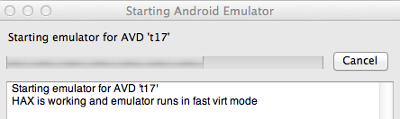

#### Getting Started

This document is written for OS X 10.8.3 or better. iOS testing requires OS X. Android testing will work on OS X, Windows, or Linux.

Install `Xcode` from the Mac app store and the command line build tools (Xcode -> Preferences -> Downloads).

- Ensure you have Ruby 1.9.3-p392 or better (1.8 is not supported). Install the latest stable patch release of Ruby 1.9.3 (not Ruby 2.0).

`$ \curl -L https://get.rvm.io | bash -s stable --ruby=1.9.3`

- Make sure RVM is using the correct Ruby by default

```
$ rvm list
$ rvm --default use 1.9.3
```

- Check that it's installed properly by printing the ruby version.

`$ ruby --version`

- Update RubyGems and Bundler.

```ruby
gem update --system ;\
gem install --no-rdoc --no-ri bundler ;\
gem update ;\
gem cleanup
```

- Install appium_console gem.

```ruby
gem uninstall -aIx appium_lib ;\
gem uninstall -aIx appium_console ;\
gem install --no-rdoc --no-ri appium_console
```

- Install [brew](http://mxcl.github.io/homebrew/)

`ruby -e "$(curl -fsSL https://raw.github.com/mxcl/homebrew/go)"`

- Install [nodejs](http://nodejs.org/) using brew.

```
brew update ;\
brew upgrade node ;\
brew install node
```

- Node should be `v0.10.2` or better.
Don't use the big green install button on nodejs.org or all npm commands will require sudo.

`$ node --version`

`$ npm --version`

- Install grunt.

`npm install -g grunt grunt-cli`

```bash
$ grunt --version
grunt-cli v0.1.6
grunt v0.4.1
```

- Install [ant](http://ant.apache.org/)
- Install [maven](http://maven.apache.org/download.cgi) if it's not already installed.

```
$ ant -version
Apache Ant(TM) version 1.8.2 compiled on June 20 2012
$ mvn -version
Apache Maven 3.0.3 (r1075438; 2011-02-28 12:31:09-0500)
```

- Clone appium

`$ git clone git://github.com/appium/appium.git`

- Run reset.sh

`cd appium; ./reset.sh`

If you see config errors, try cleaning git. `git clean -dfx; git reset --hard`

You can also reset by platform. `./reset.sh --android`

- Start appium.

`node server.js`


# Bash Profile
- Add the Android SDK tools folder to your path so you can run `android`.
- Define the `ANDROID_HOME` env var pointing to SDK root. On OSX place it in `~/.bash_profile`
- You may have to add grunt as well `/usr/local/share/npm/bin/grunt`

```
# ~/.bash_profile
export ANDROID_HOME=$HOME/Downloads/android-sdk-macosx
export ANDROID_SDK=$ANDROID_HOME
PATH=$PATH:/Applications/apache-ant-1.8.4/bin
PATH=$PATH:/usr/local/share/npm/bin/
PATH=$PATH:$HOME/Downloads/android-sdk-macosx/platform-tools
PATH=$PATH:$HOME/Downloads/android-sdk-macosx/tools
export JAVA_HOME="`/System/Library/Frameworks/JavaVM.framework/Versions/Current/Commands/java_home`"
export APP_PATH="/path/to/MyiOS.app"
export APK_PATH="/path/to/my.apk"
export APP_PACKAGE="com.example.Package"
export APP_ACTIVITY="StartActivity"
export APP_WAIT_ACTIVITY="SplashActivity"

export PATH
```

- Run `android` to open the SDK manager. 
- Install `Intel x86 Emulator Accelerator (HAXM)` under Extras
- Install API 17 `SDK Platform`, `Intel x86 Atom System Image`, `Google APIs` as in the picture.
If there are any problems viewing or downloading the packages, go to `Packages -> Reload` and try again.


- Create a new Android virtual device that uses the Intel image. Ensure `Use Host GPU` is checked.

`android avd`


- Check that `hax is working` If it's not, install hax [directly from Intel](http://software.intel.com/en-us/articles/intel-hardware-accelerated-execution-manager)



- Launch the emulator with `emulator @t17`

- After launching the emulator, check that it's listed in adb devices. Run the following commands a few times until it's listed.

`adb kill-server; adb devices`

If you see `error: protocol fault (no status)` just keep running the command until the emulator is detected.

- With both the Android emulator running and the Appium server started, it's time to launch the appium console. Make sure the ENV vars are exported.

- Echo the values to make sure they're set correctly

`$ echo $APP_PATH $APP_PACKAGE $APP_ACTIVITY $APP_WAIT_ACTIVITY`

- Start appium console

`arc`
