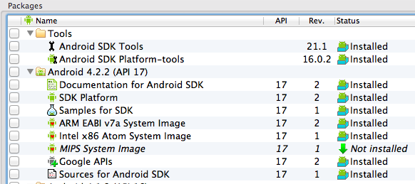
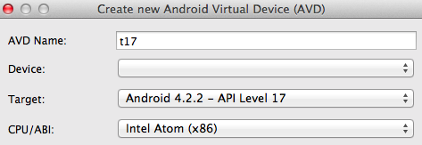

### Getting Started

This document is written for OS X 10.9.2 or better. iOS testing requires OS X. Android testing works on OS X, Windows, and Linux. 

#### Steps to install

Install `Xcode` 5.1.1.

- Xcode 5.0.0 shouldn't be used for iOS 6 as it's flaky.
- Xcode 5.0.1 is broken.
- Xcode 4.6.3 doesn't support iOS 7.

After that, install the command line build tools for your version of OS X (Xcode -> Open Developer Tools -> More Developer Tools).
 
- Install Java 7 if there's no Java on the system.
  - [JDK 7](http://www.oracle.com/technetwork/java/javase/downloads/index.html)

- Install stable release of Ruby.

`$ \curl -L https://get.rvm.io | bash -s stable --ruby`

- Make sure RVM is using the correct Ruby by default

```
$ rvm list
$ rvm --default use 2.3.0
```

- If you have an old ruby, you can installing Ruby 2.3.0 instead

```
$ rvm get head
$ rvm autolibs homebrew
$ rvm install 2.3.0
```

- Check that it's installed properly by printing the ruby version.

`$ ruby --version`

- Update RubyGems and Bundler.

```ruby
gem update --system ;\
gem install --no-rdoc --no-ri bundler ;\
gem update ;\
gem cleanup
```

- Check that RubyGems is >= 2.1.5

```bash
$ gem --version
2.6.4
```

- Install appium_console gem.

```ruby
gem uninstall -aIx appium_lib ;\
gem uninstall -aIx appium_console ;\
gem install --no-rdoc --no-ri appium_console
```

- Install [flaky](https://github.com/appium/flaky) gem.

```ruby
gem uninstall -aIx flaky ;\
gem install --no-rdoc --no-ri flaky
```

- Install [brew](http://mxcl.github.io/homebrew/)

`ruby -e "$(curl -fsSL https://raw.github.com/Homebrew/homebrew/go/install)"`

- Install [nodejs](http://nodejs.org/) using brew.

```
brew update ;\
brew upgrade node ;\
brew install node
```

- Node should be `v0.10.5` or better.
Don't use the big green install button on nodejs.org or all npm commands will require sudo.

`$ node --version`

`$ npm --version`

- Install grunt.

`npm install -g grunt grunt-cli`

- Run the version command from the appium folder. If you're not in that folder, the grunt version will not display.

```bash
$ grunt --version
grunt-cli v0.1.6
grunt v0.4.1
```

- Install [ant](http://ant.apache.org/) if it's not already installed.
- Install [maven 3.1.1 or better](http://maven.apache.org/download.cgi) if it's not already installed. Old maven will not work.

Ant and maven can be installed manually or using brew.

```bash
$ brew update
$ brew install ant
$ brew install maven
```

```
$ ant -version
Apache Ant(TM) version 1.9.7 compiled on April 9 2016
$ mvn -version
Apache Maven 3.3.9 (bb52d8502b132ec0a5a3f4c09453c07478323dc5; 2015-11-10T09:41:47-07:00)
```

- Clone appium

`$ git clone git://github.com/appium/appium.git`

- Run reset.sh. When running reset.sh, make sure to be on Xcode 5.0.2 for best results. You may have problems if you reset on Xcode 4.6.3 and then switch to a newer Xcode.

`cd appium; ./reset.sh`

If you see config errors, try cleaning git. `git clean -dfx; git reset --hard`

You can also reset by platform. `./reset.sh --android`

If npm is having issues, you may have to disable https. I don't recommend this, however if you must this is how to do so:

`npm config set registry http://registry.npmjs.org/`


- Authorize for iOS testing. Must run reset.sh as mentioned above before running the grunt task.

> sudo \`which grunt\` authorize

- Start appium.

`node .`


#### Bash Profile
- Add the Android SDK tools folder to your path so you can run `android`.
- Define the `ANDROID_HOME` env var pointing to SDK root. On OSX place it in `~/.bash_profile`
- You may have to add grunt as well `/usr/local/share/npm/bin/grunt`

```
# ~/.bash_profile
export ANDROID_HOME=$HOME/Downloads/android-sdk-macosx
export ANDROID_SDK=$ANDROID_HOME
PATH=$PATH:/Applications/apache-ant-1.8.4/bin
PATH=$PATH:/usr/local/share/npm/bin/
PATH=$PATH:$ANDROID_HOME/build-tools
PATH=$PATH:$ANDROID_HOME/platform-tools
PATH=$PATH:$ANDROID_HOME/tools
export JAVA_HOME="`/System/Library/Frameworks/JavaVM.framework/Versions/Current/Commands/java_home`"

export PATH
```

- Run `android` to open the SDK manager. 
- Install `Intel x86 Emulator Accelerator (HAXM)` under Extras
- Install API 19 `SDK Platform`, `Intel x86 Atom System Image`, `Google APIs`
If there are any problems viewing or downloading the packages, go to `Packages -> Reload` and try again.



- Create a new Android virtual device that uses the Intel image. Note that some apps may have issues when `Use Host GPU` is enabled or SD cards [aren't formatted properly](http://stackoverflow.com/questions/5744298/what-does-this-mean-failure-install-failed-container-error). Set `VM Heap` to `64`. `32` is too small. The emulator is very slow when Use Host GPU is disabled. If you have to disable it then consider testing on a physical device which will be faster.



`android avd`

- Check that `hax is working` If it's not, install hax [directly from Intel](http://software.intel.com/en-us/articles/intel-hardware-accelerated-execution-manager)

```bash
$ emulator @android
HAX is working and emulator runs in fast virt mode
```

- Launch the emulator with `emulator @android`

- After launching the emulator, check that it's listed in adb devices. Run the following commands a few times until it's listed.

`adb kill-server; adb devices`

If you see `error: protocol fault (no status)` just keep running the command until the emulator is detected.

- With both the Android emulator running and the Appium server started, it's time to launch the appium console. Make sure the ENV vars are exported.

- Start appium console

`arc`

- See [running on OS X](https://github.com/appium/appium/blob/master/docs/en/appium-setup/running-on-osx.md)

#### Troubleshooting

- If install fails, keep trying to install a few times.

When using `Appium.app` make sure to set Appium -> Preferences... -> Check "Use External Appium Package" and set it to the path of Appium cloned from GitHub.

Fix permission errors. npm shouldn't require sudo.

```bash
brew uninstall node
brew install node
rm -rf ./node_modules # run from the appium folder
rm -rf "/Users/`whoami`/.npm"
rm -rf /usr/local/lib/node_modules/ 
./reset.sh --ios
./reset.sh --android
```

- [Helper bash methods](https://gist.github.com/bootstraponline/5580587)

#### SSL Issues

> Unable to download data from https://rubygems.org/ - SSL_connect returned=1 errno=0 state=SSLv3 read server certificate B: certificate verify failed 

- [Fix SSL issues](http://railsapps.github.io/openssl-certificate-verify-failed.html) with:

```bash
$ rvm osx-ssl-certs update all
$ rvm osx-ssl-certs status all
```

#### Maven on OS X 10.9

```bash
$ cd /usr/local
$ git reset --hard origin/master

$ brew update
$ brew install maven
```

#### HAXM on OS X 10.9

Install the [HAXM 10.9 hotfix](http://software.intel.com/en-us/articles/intel-hardware-accelerated-execution-manager-end-user-license-agreement-macos-hotfix
).

#### Restore dev tools on 10.9

`xcode-select --install`

- [Install specific node version](https://coderwall.com/p/lqphzg)

#### Corrupt ruby gems

If you see:

> invalid gem: package is corrupt, exception while verifying: undefined method

Then run `$ rm -rf ~/.rvm` and reinstall RVM.
